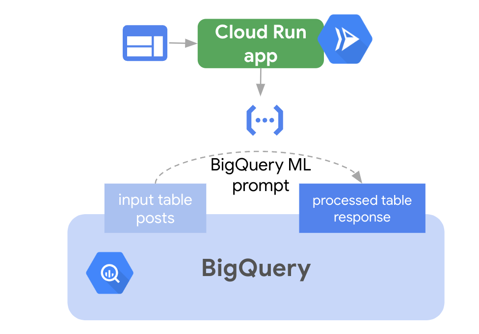
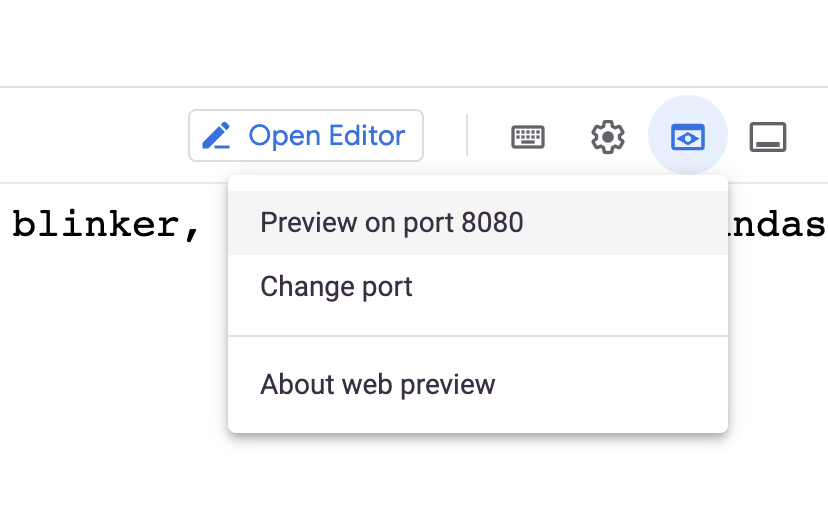

# Telecom Churn LLM Utils

This repository contains an example of a Gen-AI powered data transformation.
The use case is automated summary and content generation for telco customer churn data.

This repository inspired on [Telco Customer Churn Analysis in BigQuery with Gen-AI](https://medium.com/@sobhan.af/telco-customer-churn-analysis-in-bigquery-with-gen-ai-73a02f119cbd)

## Architecture

## Deployment

* From Cloud Shell, clone this repository
* Login into your existing Argolis account, executing `gcloud auth login`
* Select your project `gcloud config set project PROJECT_ID`
* Navigate to the `src` folder and locate the `setup_demo.sh` script
* Launch the `setup_demo.sh` script, for example `setup_demo.sh ${GOOGLE_CLOUD_PROJECT}`
    - This will create in BigQuery: dataset, table, external connection, LLM model and setup some IAM permissions
    - This will deploy a Cloud Function to perform batch inference

### Local
First, you can test the deployment locally.
* Navigate to the `src` folder and locate the `launch_local_test.sh` script
* Launch the `launch_local_test.sh` script, for example `launch_local_test.sh`
* Click on Web Preview

### Google Cloud

Now , you can deploy the demo on Cloud Run.
* Navigate to the `src` folder and locate the `build_cloud_run_frontend.sh` script
* Launch the `build_cloud_run_frontend.sh` script, for example `source build_cloud_run_frontend.sh`
* Navigate to Cloud Run and open the `data-llm-ct-churn` service
* Click on the application URL
 

